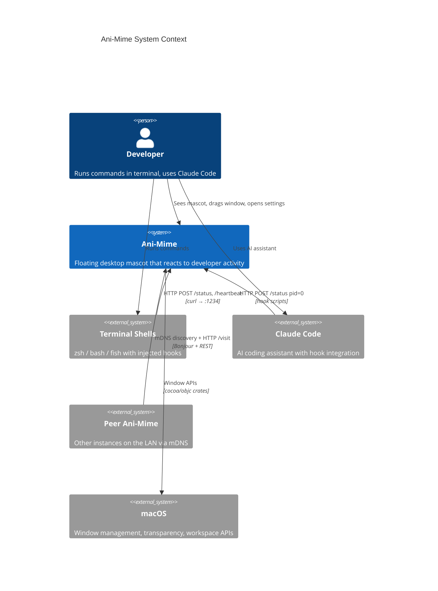
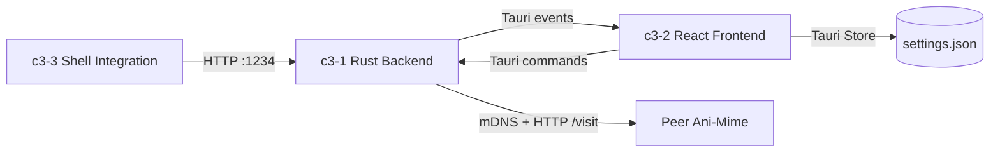

# Ani-Mime

## Goal

Provide real-time visual feedback of terminal and Claude Code activity through a floating macOS desktop mascot (pixel dog) that lives on the developer's screen.

## Overview



## Data Flow

```
Shell hooks (curl) → HTTP :1234 → Rust AppState → Tauri event → React hooks → Sprite animation
```

## Actors

| Actor | Interaction | Protocol |
|-------|------------|----------|
| Developer | Views mascot, drags window, configures settings | Direct UI |
| Terminal (zsh/bash/fish) | Reports command start/end, heartbeats | HTTP to :1234 |
| Claude Code | Reports busy/idle state (pid=0) | HTTP to :1234 via hooks |
| Peer Ani-Mime instances | Discover each other, send visiting dogs | mDNS + HTTP /visit |
| macOS | Window transparency, workspace visibility, tiling | cocoa/objc private APIs |

## Abstract Constraints

| Constraint | Rationale | Affected Containers |
|------------|-----------|---------------------|
| Single status winner | Multiple terminals → one mascot. Priority: busy > service > idle > disconnected | c3-1, c3-2 |
| Port 1234 hardcoded | Shell scripts, Claude hooks, and Rust server must agree on port (override: `ANI_MIME_PORT`) | c3-1, c3-3 |
| pid=0 reserved for Claude | Virtual session that never times out, distinguishes AI activity from terminal activity | c3-1, c3-3 |
| Three shells in sync | Any hook change must be applied to zsh, bash, AND fish identically | c3-3 |
| Status strings synced manually | Frontend and backend status enums have no codegen — must be updated in both places | c3-1, c3-2 |
| macOS only | Uses private NSWindow APIs, Bonjour/mDNS, and macOS-specific platform code | c3-1 |

## Containers

| ID | Name | Boundary | Status | Responsibilities | Goal Contribution |
|----|------|----------|--------|------------------|-------------------|
| c3-1 | Rust Backend | app | active | HTTP server, state management, peer discovery, watchdog, setup flow, platform APIs | Receives activity signals, resolves status, emits events to frontend |
| c3-2 | React Frontend | app | active | Mascot rendering, status UI, settings, visitor display, sprite animation | Visualizes the mascot state as an animated pixel dog with status indicators |
| c3-3 | Shell Integration | library | active | Shell hooks (zsh/bash/fish), Claude Code hooks, command classification | Bridges developer activity in terminals and Claude Code to the backend via HTTP |

## Linkages



## Statuses

| Status | Meaning | Priority | Visual |
|--------|---------|----------|--------|
| initializing | App just launched | — | Sniffing animation |
| searching | Looking for terminals | — | Sniffing animation |
| busy | Command running in some terminal | 1 (highest) | Running animation, red dot |
| service | Dev server detected (flashes 2s) | 2 | Barking animation, purple dot |
| idle | All terminals idle | 3 | Sitting animation, green dot |
| disconnected | No terminals connected | 4 (lowest) | Sleeping animation, grey dot |
| visiting | Dog is visiting a peer | — | Hidden locally, shown on peer |
