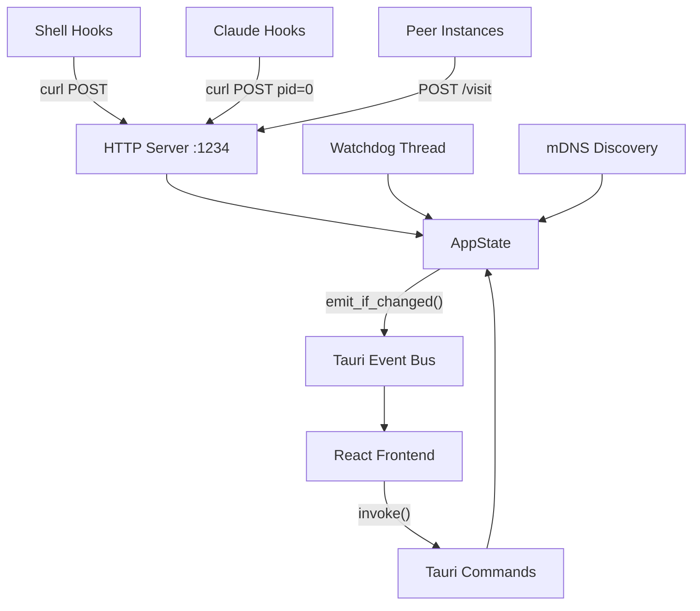

# Rust Backend

## Goal

Receive activity signals from shells and Claude Code via HTTP, manage session state, resolve a single display status from multiple sources, and emit Tauri events to drive the frontend UI.

## Responsibilities

- Accept HTTP requests from shell hooks and Claude Code hooks on port 1234
- Track per-terminal sessions (by PID) with state, timestamps, and command info
- Resolve a single UI status from all active sessions using priority rules
- Emit Tauri events (`status-changed`, `task-completed`, `visitor-arrived`, etc.) when state changes
- Run a background watchdog for session cleanup and state transitions
- Discover and communicate with peer Ani-Mime instances via mDNS
- Auto-setup shell hooks and Claude hooks on first launch
- Expose Tauri commands for frontend → backend communication

## Overview

## Complexity Assessment

**Level:** complex
**Why:** Concurrent access to shared state (Arc<Mutex<AppState>>), multiple background threads (HTTP server, watchdog, mDNS), session lifecycle management, priority-based state resolution, and cross-platform concerns (macOS private APIs).

## Components

| ID | Name | Category | Status | Goal Contribution |
|----|------|----------|--------|-------------------|
| c3-101 | [HTTP Server](c3-101-http-server.md) | foundation | active | Accepts activity signals from shells and peers via REST endpoints |
| c3-102 | [State Management](c3-102-state-management.md) | foundation | active | Tracks sessions, resolves priority status, emits change events |
| c3-110 | [Watchdog](c3-110-watchdog.md) | feature | active | Background cleanup: session timeouts, service→idle transitions, idle→sleep |
| c3-111 | [Peer Discovery](c3-111-peer-discovery.md) | feature | active | mDNS registration/browsing for LAN peer visits |
| c3-112 | [Setup Flow](c3-112-setup-flow.md) | feature | active | First-launch auto-configuration of shell and Claude hooks |

## Layer Constraints

This container operates within these boundaries:

**MUST:**
- Coordinate components within its boundary
- Define how context linkages are fulfilled internally
- Own its technology stack decisions

**MUST NOT:**
- Define system-wide policies (context responsibility)
- Implement business logic directly (component responsibility)
- Bypass refs for cross-cutting concerns
- Orchestrate other containers (context responsibility)
