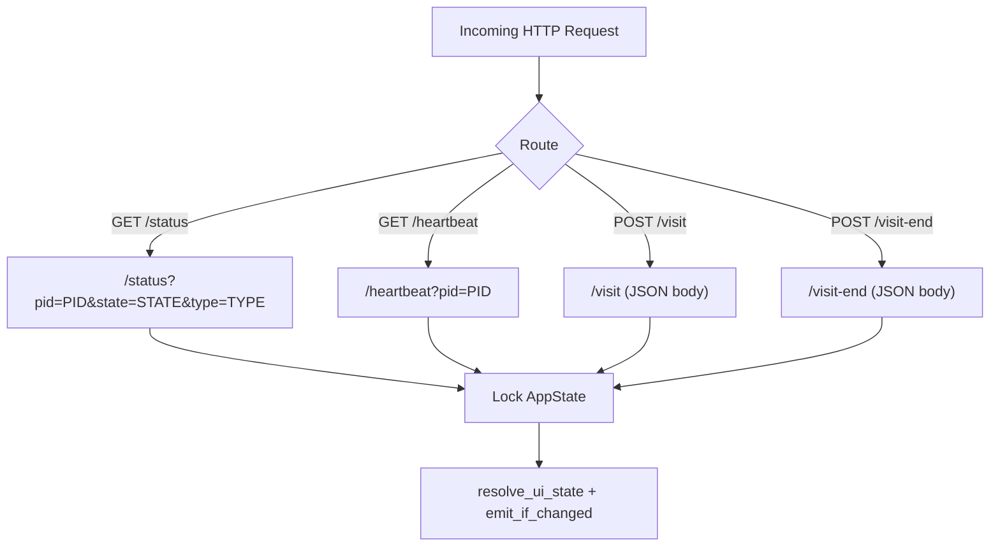

# HTTP Server

## Goal

Accept activity signals from shell hooks, Claude hooks, and peer instances via REST endpoints on port 1234, parse them into state updates, and trigger status resolution.

## Container Connection

Without the HTTP server, no external source (terminals, Claude, peers) can communicate activity to the backend. It is the sole ingress point for all state-changing signals.

## Endpoints

| Endpoint | Method | Parameters | Effect |
|----------|--------|-----------|--------|
| `/status` | GET | `pid`, `state` (busy\|idle), `type` (task\|service) | Create/update session, trigger resolution |
| `/heartbeat` | GET | `pid` | Refresh session timestamp (prevents timeout) |
| `/visit` | POST | JSON: `nickname`, `pet`, `fromHost` | Add visiting dog, emit `visitor-arrived` |
| `/visit-end` | POST | JSON: `fromHost` | Remove visiting dog, emit `visitor-left` |

## Dependencies

| Direction | What | From/To |
|-----------|------|---------|
| IN (uses) | HTTP requests | Shell hooks (c3-301), Claude hooks (c3-310), Peer instances |
| IN (uses) | AppState (Arc<Mutex>) | c3-102 State Management |
| OUT (provides) | State mutation + event emission | c3-102 → Tauri Event Bus |

## Code References

| File | Purpose |
|------|---------|
| `src-tauri/src/server.rs` | HTTP server implementation, endpoint routing, request parsing |
| `src-tauri/src/helpers.rs` | `get_port()`, `get_query_param()`, `format_http_host()` utilities |
