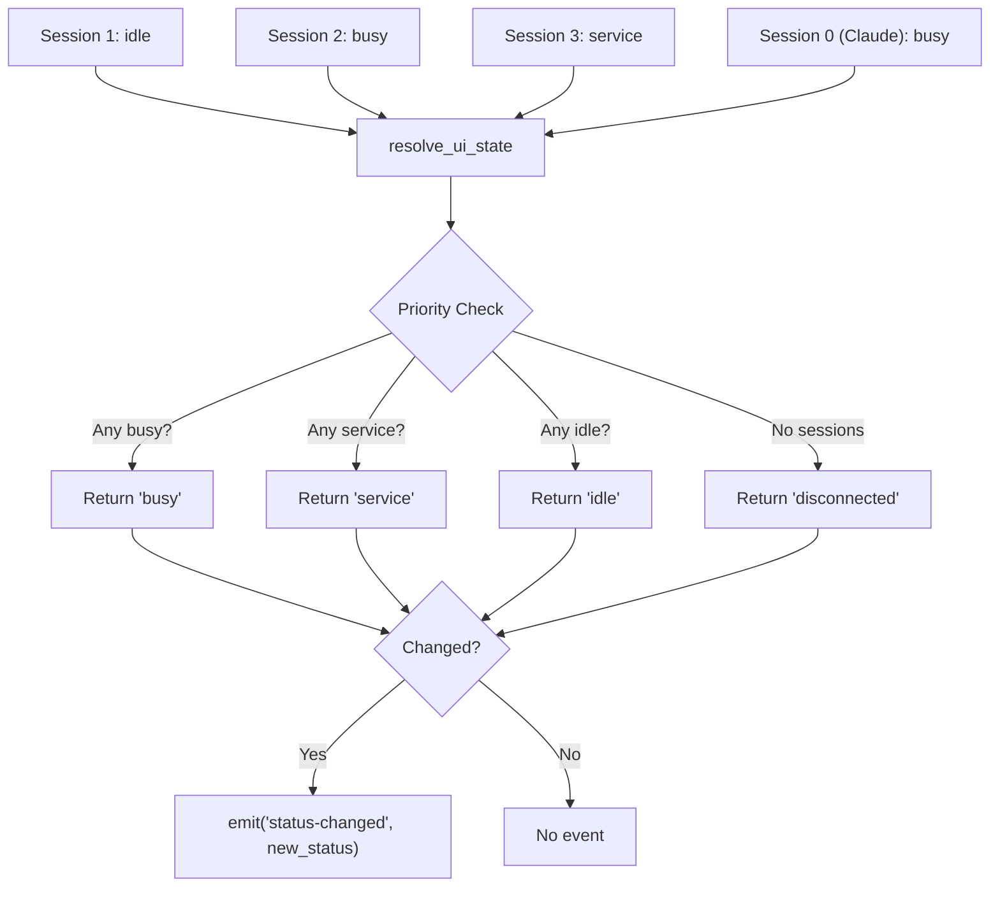

# State Management

## Goal

Track per-terminal sessions and resolve a single display status from multiple concurrent sources using priority rules, emitting Tauri events only when the resolved status actually changes.

## Container Connection

The central nervous system of the backend. Every other component reads or writes AppState. Without it, there is no way to aggregate multiple terminal sessions into a single mascot state.

## State Resolution

## Key Structures

| Structure | Purpose |
|-----------|---------|
| `AppState` | Top-level state: sessions HashMap, peers Vec, visitors Vec, current_ui String |
| `Session` | Per-PID: ui_state, busy_since, service_since, last_heartbeat, command info |
| `VisitingDog` | Incoming visitor: nickname, pet, fromHost, arrived_at |

## Critical Rules

- **pid=0** is reserved for Claude Code — never times out, never cleaned up by watchdog
- **Priority order**: busy > service > idle > disconnected — always one winner
- **emit_if_changed()**: only fires `status-changed` when the resolved state differs from `current_ui`
- **Service display**: service_since timestamp enables the 2-second flash before transition to idle

## Dependencies

| Direction | What | From/To |
|-----------|------|---------|
| IN (uses) | State mutations | c3-101 HTTP Server, c3-110 Watchdog, c3-111 Peer Discovery |
| OUT (provides) | Resolved UI status + Tauri events | c3-2 React Frontend (via event bus) |
| OUT (provides) | Session data for cleanup | c3-110 Watchdog |

## Code References

| File | Purpose |
|------|---------|
| `src-tauri/src/state.rs` | AppState struct, Session struct, resolve_ui_state(), emit_if_changed() |
