# Watchdog

## Goal

Perform background state transitions and session cleanup to keep the mascot responsive when terminals disconnect or go silent, without requiring explicit "goodbye" signals.

## Container Connection

Terminals can crash, close, or lose network. Without the watchdog, stale sessions would accumulate and the mascot could be permanently stuck in "busy" or "service" state.

## Timing

```mermaid
gantt
  title Watchdog Transitions
  dateFormat X
  axisFormat %s

  section Service Flash
  service displayed :0, 2
  transition to idle :2, 3

  section Session Timeout
  last heartbeat :0, 20
  grace period :20, 40
  session removed :40, 41

  section Idle → Sleep
  idle state :0, 120
  transition to sleep :120, 121
```

| Timer | Duration | Action |
|-------|----------|--------|
| Service display | 2 seconds | service → idle (prevents permanent blue state for dev servers) |
| Session timeout | 40 seconds | Remove sessions with no heartbeat (heartbeat interval is 20s) |
| Idle → sleep | 120 seconds | idle → disconnected/sleep if no activity |
| Watchdog tick | 2 seconds | Check interval for all of the above |

## Critical Rules

- **Never cleans up pid=0** (Claude Code session is exempt from timeout)
- Runs in a dedicated `std::thread` spawned at app startup
- Holds the `AppState` mutex briefly per tick — must not block HTTP handling

## Dependencies

| Direction | What | From/To |
|-----------|------|---------|
| IN (uses) | Session timestamps | c3-102 State Management |
| OUT (provides) | State transitions + session removal | c3-102 State Management |

## Code References

| File | Purpose |
|------|---------|
| `src-tauri/src/watchdog.rs` | Watchdog thread loop, transition logic, session cleanup |
