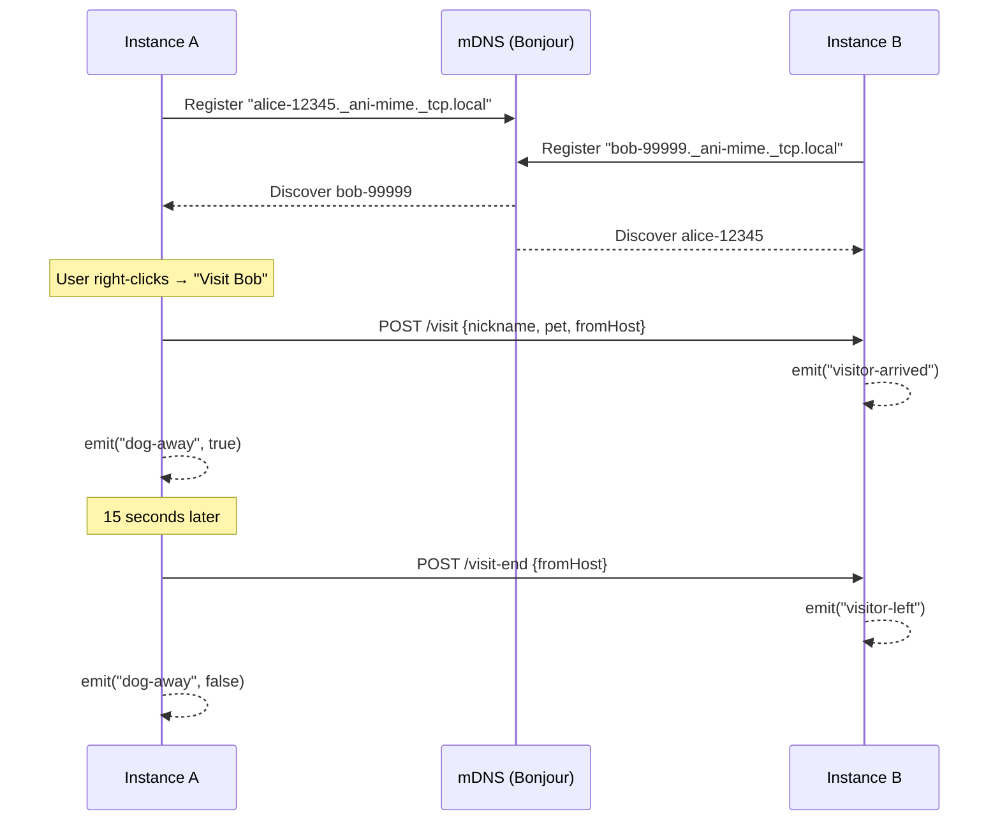

# Peer Discovery

## Goal

Enable LAN peer discovery and dog visits between Ani-Mime instances using mDNS/Bonjour, allowing developers to see each other's mascots visit their screen.

## Container Connection

Powers the social feature of Ani-Mime — without peer discovery, the app is isolated. Provides the peer list for the context menu "Visit" action and handles the visit protocol.

## Protocol

## mDNS Service

| Field | Value |
|-------|-------|
| Service type | `_ani-mime._tcp.local` |
| Instance name | `{nickname}-{port}` |
| Port | 1234 (or ANI_MIME_PORT) |
| TXT records | nickname, pet, version |

## Dependencies

| Direction | What | From/To |
|-----------|------|---------|
| IN (uses) | Peer registry in AppState | c3-102 State Management |
| IN (uses) | Visit HTTP endpoints | c3-101 HTTP Server |
| OUT (provides) | Peer list + visit events | c3-2 React Frontend (usePeers, useVisitors hooks) |

## Code References

| File | Purpose |
|------|---------|
| `src-tauri/src/discovery.rs` | mDNS daemon, service registration, peer browsing, address detection |
| `src-tauri/src/lib.rs` | `start_visit` Tauri command, visit thread spawning |
