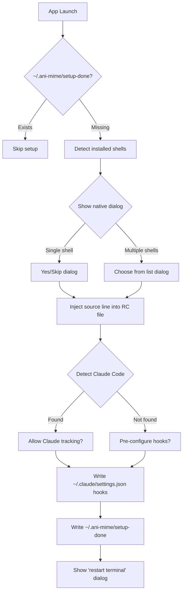

# Setup Flow

## Goal

Auto-configure shell hooks and Claude Code hooks on first launch, guiding the user through native macOS dialogs to select which shells to integrate and whether to enable Claude tracking.

## Container Connection

Without setup, no shell hooks are installed and no signals reach the backend. This component bridges the gap between "app installed" and "app receiving terminal activity."

## Flow

## What Gets Injected

| Target | Injection |
|--------|----------|
| `~/.zshrc` | `source "/Applications/ani-mime.app/.../terminal-mirror.zsh"` |
| `~/.bashrc` | `source "/Applications/ani-mime.app/.../terminal-mirror.bash"` |
| `~/.config/fish/config.fish` | `source "/Applications/ani-mime.app/.../terminal-mirror.fish"` |
| `~/.claude/settings.json` | PreToolUse, Stop, SessionEnd hooks with curl commands |

## Dependencies

| Direction | What | From/To |
|-----------|------|---------|
| IN (uses) | Shell detection, RC file paths | Host filesystem |
| OUT (provides) | Configured shell hooks | c3-301 Terminal Mirror (enabled via sourcing) |
| OUT (provides) | Configured Claude hooks | c3-310 Claude Hooks (enabled via settings.json) |

## Code References

| File | Purpose |
|------|---------|
| `src-tauri/src/setup/shell.rs` | Shell detection, RC file editing, native dialog prompts |
| `src-tauri/src/setup/claude.rs` | Claude Code detection, settings.json hook migration |
