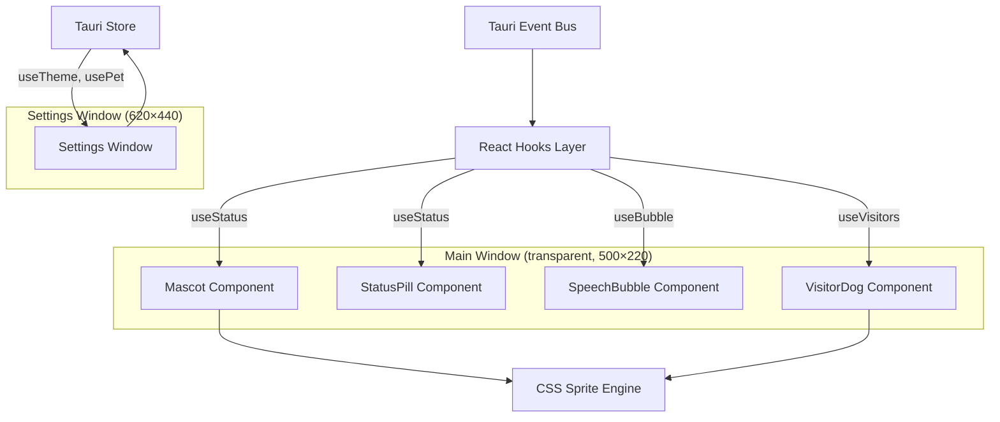

# React Frontend

## Goal

Visualize the resolved mascot state as animated pixel art with status indicators, manage user settings (theme, pet, glow), and render peer visiting dogs — all driven by Tauri events from the backend.

## Responsibilities

- Render the animated pixel mascot based on current status (7 states × multiple characters)
- Display status indicator pill with color-coded dot and label
- Show speech bubbles for task completion and discovery hints
- Render visiting dogs from peer Ani-Mime instances
- Provide a settings window for theme, pet selection, nickname, and glow mode
- Persist user preferences via Tauri Store
- Support window dragging on the transparent, always-on-top main window
- Provide a developer superpower tool for debugging and scenario testing

## Overview

## Complexity Assessment

**Level:** moderate
**Why:** Multiple hook-driven state sources converging on a single render, CSS sprite animation timing, cross-window event broadcasting, transparent window with drag support. UI logic is straightforward but the animation system requires precise frame timing.

## Components

| ID | Name | Category | Status | Goal Contribution |
|----|------|----------|--------|-------------------|
| c3-201 | [Hooks Layer](c3-201-hooks.md) | foundation | active | Bridges Tauri events into React state (useStatus, usePeers, useBubble, etc.) |
| c3-202 | [Sprite Engine](c3-202-sprite-engine.md) | foundation | active | CSS-based animation with steps() timing, sprite registry, auto-freeze |
| c3-210 | [Mascot UI](c3-210-mascot-ui.md) | feature | active | Main character rendering, status pill, speech bubble, visitor dogs |
| c3-211 | [Settings](c3-211-settings.md) | feature | active | Theme, pet, nickname, glow configuration with persistent storage |

## Layer Constraints

This container operates within these boundaries:

**MUST:**
- Coordinate components within its boundary
- Define how context linkages are fulfilled internally
- Own its technology stack decisions

**MUST NOT:**
- Define system-wide policies (context responsibility)
- Implement business logic directly (component responsibility)
- Bypass refs for cross-cutting concerns
- Orchestrate other containers (context responsibility)
