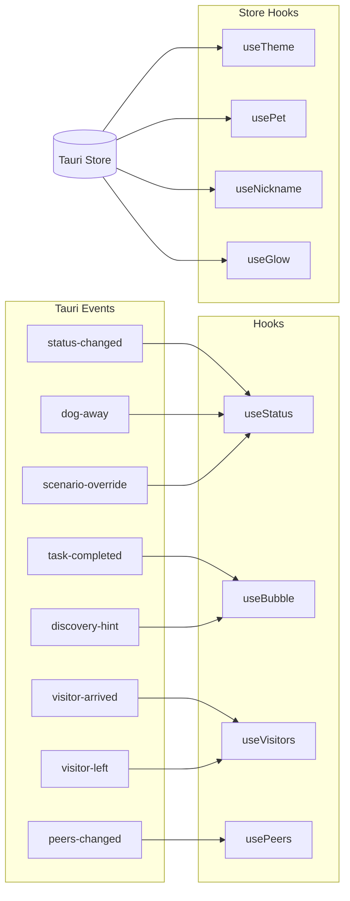

# Hooks Layer

## Goal

Bridge Tauri backend events and the persistent Tauri Store into React state, providing a clean API for UI components to consume status, peer, visitor, and preference data.

## Container Connection

All UI components depend on hooks for their data. Without this layer, there is no connection between backend events and React rendering.

## Hook Inventory

| Hook | Source | Returns | Used By |
|------|--------|---------|---------|
| `useStatus()` | `status-changed`, `dog-away`, `scenario-override` events | Current display status string | Mascot, StatusPill |
| `usePeers()` | `peers-changed` event | Array of discovered peers | Context menu |
| `useVisitors()` | `visitor-arrived`, `visitor-left` events | Array of visiting dogs | VisitorDog components |
| `useBubble()` | `task-completed`, `discovery-hint` events | { visible, message } | SpeechBubble |
| `useTheme()` | Tauri Store + `theme-changed` event | [theme, setTheme] | Settings, CSS variables |
| `usePet()` | Tauri Store + `pet-changed` event | [pet, setPet] | Mascot sprite selection |
| `useNickname()` | Tauri Store + `nickname-changed` event | [nickname, setNickname] | Settings, visit protocol |
| `useGlow()` | Tauri Store + `glow-changed` event | [glowMode, setGlowMode] | CSS glow effects |
| `useDrag()` | Native Tauri `startDragging()` | onMouseDown handler | Main window |
| `useDevMode()` | Session state (10× version click) | boolean | Superpower access |

## Dependencies

| Direction | What | From/To |
|-----------|------|---------|
| IN (uses) | Tauri events | c3-1 Rust Backend (event bus) |
| IN (uses) | Persistent settings | Tauri Store (settings.json on disk) |
| OUT (provides) | Reactive state | c3-210 Mascot UI, c3-211 Settings |

## Code References

| File | Purpose |
|------|---------|
| `src/hooks/useStatus.ts` | Status resolution from events |
| `src/hooks/usePeers.ts` | Peer list management |
| `src/hooks/useVisitors.ts` | Visitor tracking |
| `src/hooks/useBubble.ts` | Speech bubble trigger logic |
| `src/hooks/useTheme.ts` | Theme persistence |
| `src/hooks/usePet.ts` | Pet selection persistence |
| `src/hooks/useNickname.ts` | Nickname persistence |
| `src/hooks/useGlow.ts` | Glow mode persistence |
| `src/hooks/useDrag.ts` | Window drag handler |
| `src/hooks/useDevMode.ts` | Dev mode toggle |
