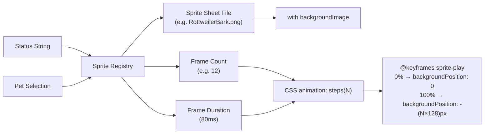

# Sprite Engine

## Goal

Animate pixel art characters using CSS sprite sheets with precise frame timing, supporting multiple characters and statuses, with auto-freeze when the window is not visible.

## Container Connection

The visual core of Ani-Mime. Without the sprite engine, there is no animated mascot — just a static image. It translates status strings into living pixel art.

## Animation Model

| Parameter | Value |
|-----------|-------|
| Frame size | 128 × 128 pixels |
| Frame duration | 80ms per frame |
| Sheet layout | Horizontal strip (frames side by side) |
| Animation function | `steps(N)` where N = frame count |
| Total duration | N × 80ms (e.g. 12 frames = 960ms) |

## Sprite Registry

Maps `(character, status)` → `{ file, frames }`:

| Character | Statuses covered |
|-----------|-----------------|
| Rottweiler | initializing, searching, busy, service, idle, disconnected, visiting |
| Dalmatian | Same set |
| Samurai | Same set |
| Hancock | Same set |

## Auto-Freeze

When the mascot is not visible (e.g., app minimized or on different space), the CSS animation is paused to save CPU. Resumes when visible again using the Page Visibility API.

## Dependencies

| Direction | What | From/To |
|-----------|------|---------|
| IN (uses) | Status + pet selection | c3-201 Hooks Layer |
| IN (uses) | Sprite sheet PNG files | `public/sprites/` directory |
| OUT (provides) | Animated `
` element | c3-210 Mascot UI |

## Code References

| File | Purpose |
|------|---------|
| `src/constants/sprites.ts` | Sprite registry: character → status → { file, frames } |
| `src/components/Mascot.tsx` | Sprite rendering, CSS animation application, auto-freeze |
| `src/styles/mascot.css` | @keyframes sprite-play, steps() animation rules |
