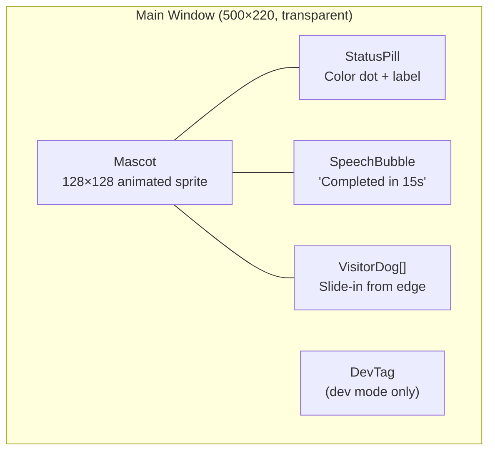

# Mascot UI

## Goal

Compose the main window experience: animated mascot character, color-coded status pill, speech bubbles, visiting dogs from peers, and window drag interaction — all in a transparent, always-on-top window.

## Container Connection

This is the feature users see and interact with. It composes all foundation components (hooks, sprite engine) into the final visual product.

## Layout

## Sub-Components

| Component | Purpose | Data Source |
|-----------|---------|------------|
| `Mascot` | Animated pixel character based on status + pet | useStatus, usePet |
| `StatusPill` | Dot (colored by status) + label text | useStatus |
| `SpeechBubble` | Temporary message overlay (3s display) | useBubble |
| `VisitorDog` | Peer dog sliding in/out with nickname | useVisitors |
| `DevTag` | "DEV" badge shown in dev mode | useDevMode |

## Status → Visual Mapping

| Status | Dot Color | Label | Animation |
|--------|-----------|-------|-----------|
| busy | Red | "Working" | Running |
| service | Purple | "Service" | Barking |
| idle | Green | "Free" | Sitting |
| disconnected | Grey | "Offline" | Sleeping |
| visiting | — | "Visiting..." | Hidden locally |
| initializing | Yellow | "Starting" | Sniffing |
| searching | Yellow | "Searching" | Sniffing |

## Dependencies

| Direction | What | From/To |
|-----------|------|---------|
| IN (uses) | Reactive state | c3-201 Hooks Layer (all hooks) |
| IN (uses) | Animated sprites | c3-202 Sprite Engine |
| OUT (provides) | Visual desktop mascot | Developer (end user) |

## Code References

| File | Purpose |
|------|---------|
| `src/App.tsx` | Root component, hook composition, sub-component orchestration |
| `src/components/Mascot.tsx` | Sprite rendering with auto-freeze |
| `src/components/StatusPill.tsx` | Status dot + label |
| `src/components/SpeechBubble.tsx` | Temporary message overlay |
| `src/components/VisitorDog.tsx` | Peer visiting dog rendering |
| `src/components/DevTag.tsx` | Dev mode indicator |
