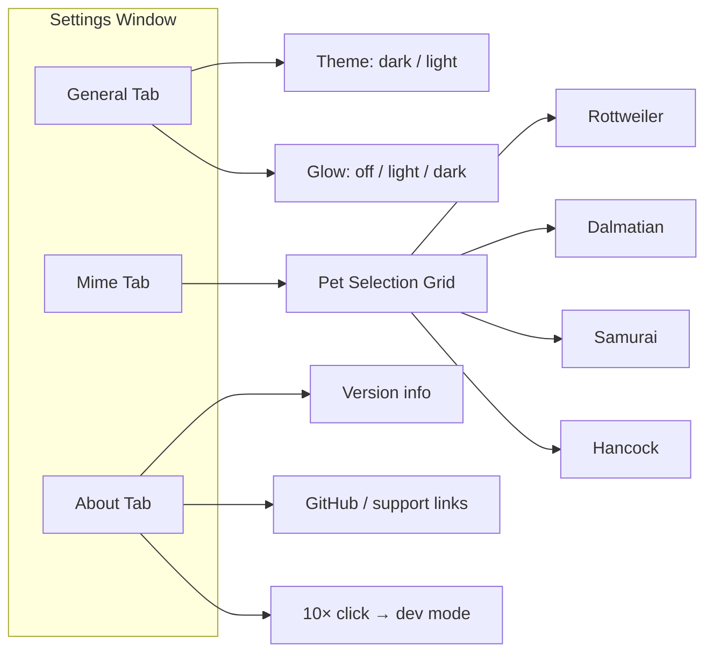

# Settings

## Goal

Allow users to configure theme, pet character, nickname, and glow mode through a dedicated settings window, with all preferences persisted to disk via Tauri Store.

## Container Connection

Without settings, users are locked to defaults. This component provides personalization and is the only way to change the mascot character, theme, or visual effects.

## Window

| Property | Value |
|----------|-------|
| Size | 620 × 440 px |
| Decorations | Standard window chrome |
| Position | Centered on screen |
| Trigger | Context menu → "Settings" or DevTag button |

## Tabs

## Persistence

| Store Key | Type | Default | Effect |
|-----------|------|---------|--------|
| `theme` | `"dark" \| "light"` | `"dark"` | CSS variables swap |
| `pet` | `string` | `"rottweiler"` | Sprite sheet selection |
| `nickname` | `string` | `""` | Shown to peers on visit |
| `glowMode` | `"off" \| "light" \| "dark"` | `"off"` | CSS glow filter |
| `bubbleEnabled` | `boolean` | `true` | Speech bubble toggle |

Changes broadcast cross-window events (e.g., `theme-changed`) so the main window updates immediately.

## Dependencies

| Direction | What | From/To |
|-----------|------|---------|
| IN (uses) | Current preferences | Tauri Store (settings.json) |
| OUT (provides) | Updated preferences | Tauri Store → cross-window events → main window hooks |

## Code References

| File | Purpose |
|------|---------|
| `src/components/Settings.tsx` | Settings window UI, tab navigation, preference controls |
| `src/hooks/useTheme.ts` | Theme read/write with store |
| `src/hooks/usePet.ts` | Pet read/write with store |
| `src/hooks/useGlow.ts` | Glow mode read/write with store |
