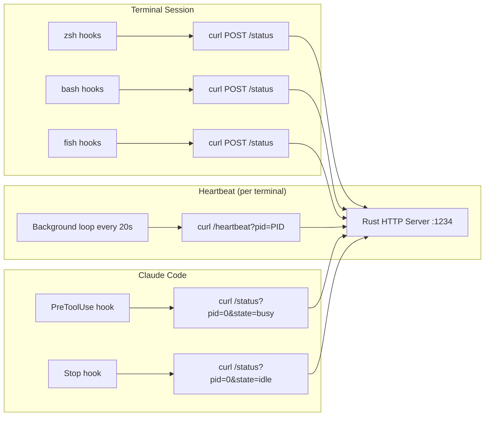

# Shell Integration

## Goal

Bridge developer terminal activity (command execution, dev servers, idle state) and Claude Code activity to the Rust backend via HTTP signals on port 1234.

## Responsibilities

- Hook into shell command lifecycle (preexec/precmd for zsh, DEBUG/PROMPT_COMMAND for bash, events for fish)
- Classify commands as task vs. service (dev server detection by keyword matching)
- Report state transitions: idle → busy (preexec), busy → idle (precmd)
- Send periodic heartbeats (every 20s) to prevent session timeout
- Provide Claude Code hooks that report busy/idle with reserved pid=0
- Maintain identical behavior across all three shells

## Overview

## Complexity Assessment

**Level:** moderate
**Why:** Three shell languages with different hook mechanisms must produce identical behavior. Background heartbeat processes must be managed carefully (start on first command, don't duplicate). Command classification uses keyword matching which can have edge cases.

## Components

| ID | Name | Category | Status | Goal Contribution |
|----|------|----------|--------|-------------------|
| c3-301 | [Terminal Mirror](c3-301-terminal-mirror.md) | foundation | active | Shell hook scripts (zsh/bash/fish) that classify and report terminal activity |
| c3-310 | [Claude Hooks](c3-310-claude-hooks.md) | feature | active | Claude Code integration via hook scripts using reserved pid=0 |

## Layer Constraints

This container operates within these boundaries:

**MUST:**
- Coordinate components within its boundary
- Define how context linkages are fulfilled internally
- Own its technology stack decisions

**MUST NOT:**
- Define system-wide policies (context responsibility)
- Implement business logic directly (component responsibility)
- Bypass refs for cross-cutting concerns
- Orchestrate other containers (context responsibility)
