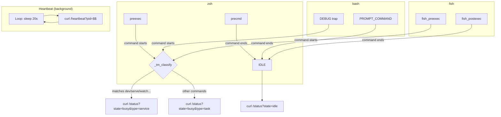

# Terminal Mirror

## Goal

Hook into zsh, bash, and fish command lifecycle to report terminal activity (command start, command end, heartbeat) to the Rust backend via HTTP on port 1234.

## Container Connection

The primary data source for the backend. Without terminal mirror, the mascot has no awareness of terminal activity and stays in "disconnected" state.

## Hook Mechanism

## Command Classification

The `_tm_classify` function checks the command string against keyword lists:

| Type | Keywords (partial match) | Example |
|------|------------------------|---------|
| service | `dev`, `serve`, `start`, `watch`, `run`, `up` | `yarn dev`, `npm start` |
| task | Everything else | `git commit`, `cargo build` |

## Three-Shell Sync Rule

All three scripts must implement identical logic:
1. **Preexec**: classify command → POST /status with busy + type
2. **Precmd/postexec**: POST /status with idle
3. **Heartbeat**: background loop every 20s → GET /heartbeat
4. **PID**: use `$$` (shell PID) as session identifier

## Dependencies

| Direction | What | From/To |
|-----------|------|---------|
| IN (uses) | Shell hook APIs | zsh (preexec/precmd), bash (DEBUG/PROMPT_COMMAND), fish (events) |
| OUT (provides) | HTTP activity signals | c3-101 HTTP Server |

## Code References

| File | Purpose |
|------|---------|
| `src-tauri/script/terminal-mirror.zsh` | zsh preexec/precmd hooks + heartbeat |
| `src-tauri/script/terminal-mirror.bash` | bash DEBUG trap + PROMPT_COMMAND hooks |
| `src-tauri/script/terminal-mirror.fish` | fish fish_preexec/fish_postexec events |
