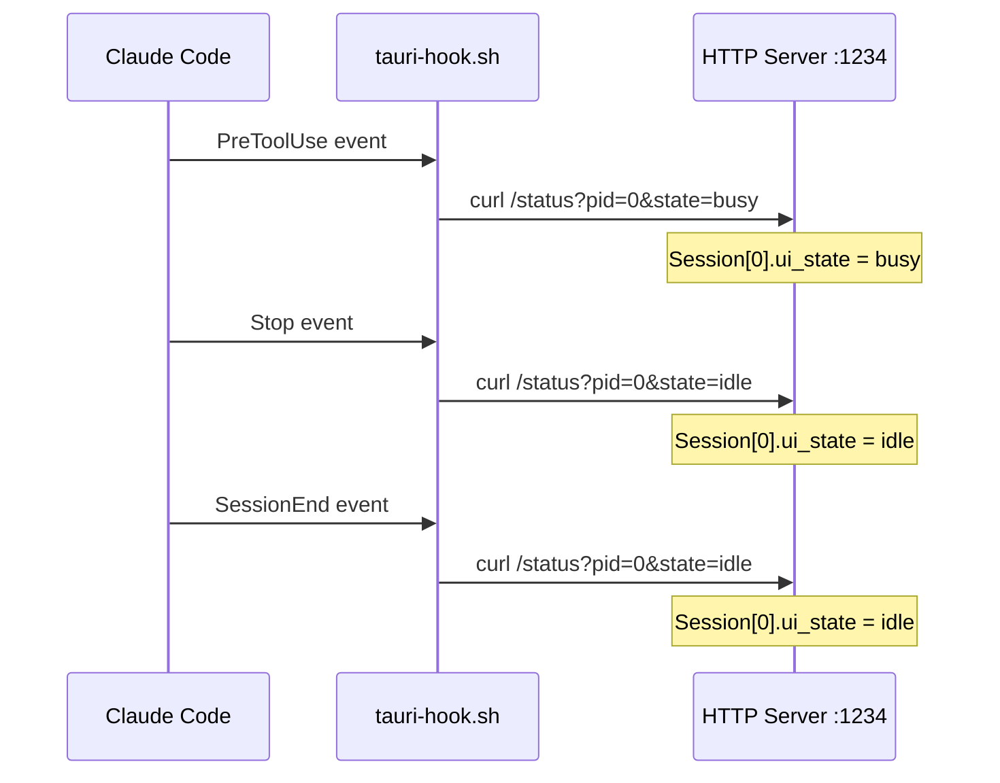

# Claude Hooks

## Goal

Track Claude Code AI activity through hook scripts that report busy/idle state using the reserved pid=0 session, allowing the mascot to react when Claude is thinking.

## Container Connection

Extends the mascot's awareness beyond terminal commands to AI assistant activity. Without Claude hooks, the mascot ignores Claude Code sessions entirely.

## Hook Configuration

## Settings.json Hooks

Configured in `~/.claude/settings.json`:

| Hook Event | Action | Effect |
|-----------|--------|--------|
| `PreToolUse` | `curl /status?pid=0&state=busy` | Mascot shows busy (Claude thinking) |
| `Stop` | `curl /status?pid=0&state=idle` | Mascot returns to idle |
| `SessionEnd` | `curl /status?pid=0&state=idle` | Cleanup when session ends |

## Critical Rules

- **pid=0 is reserved** — the watchdog never times out or cleans up this session
- **No heartbeat needed** — Claude hooks fire on specific events, not on a timer
- **Priority applies** — if a terminal is also busy, terminal busy wins (same priority level, but Claude's pid=0 is just another session in the priority resolution)

## Dependencies

| Direction | What | From/To |
|-----------|------|---------|
| IN (uses) | Claude Code hook events | Claude Code (`~/.claude/settings.json`) |
| OUT (provides) | HTTP activity signals (pid=0) | c3-101 HTTP Server |

## Code References

| File | Purpose |
|------|---------|
| `src-tauri/script/tauri-hook.sh` | Curl wrapper script invoked by Claude hooks |
| `src-tauri/src/setup/claude.rs` | Auto-configuration of Claude settings.json hooks |
