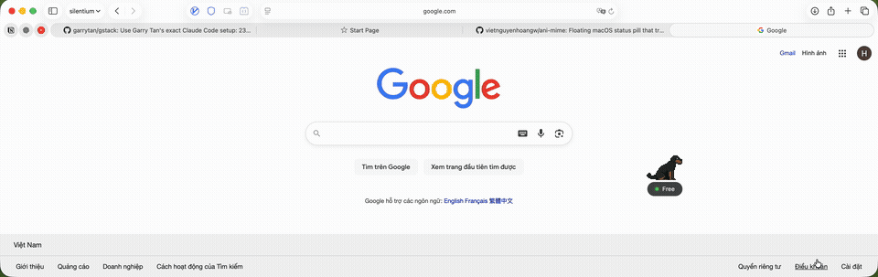

# Ani-Mime

<p align="center">
  
</p>

<p align="center">
  <strong>A floating pixel mascot that mirrors your terminal & Claude Code activity on macOS.</strong>
</p>

<p align="center">
  <a href="https://github.com/vietnguyenhoangw/ani-mime/releases"></a>
  <a href="https://github.com/vietnguyenhoangw/ani-mime/blob/main/LICENSE"></a>
  
</p>

<p align="center">
  
</p>

---

## What is Ani-Mime?

A tiny always-on-top pixel dog that reacts to what your terminal is doing. It sniffs when you're building, barks when a dev server is running, sits when you're free, and sleeps when nothing's happening.

It also integrates with **Claude Code** — the dog knows when Claude is thinking vs waiting for you.

<p align="center">
  
</p>

## Mascot States

| Status | Dot | Mascot | Meaning |
| :--- | :--- | :--- | :--- |
| **Free** | Green | Sitting | Terminal idle, ready for commands |
| **Working** | Red (pulse) | Sniffing | Running a task (build, git push, etc.) |
| **Service** | Blue | Barking | Dev server launched (vite, metro, etc.) |
| **Searching** | Yellow (pulse) | Idle | Waiting for connection |
| **Sleep** | Gray | Sleeping | Terminal closed or 10s of inactivity |

## Features

- **Pixel Art Mascot** — animated sprite sheet dog above the status pill
- **Custom Sprites** — upload your own PNG sprite sheets via manual import or smart extraction with chroma-key background removal
- **Frame Range Expressions** — specify frames as ranges like `1-5` or `41-55,57,58` when importing custom sprites
- **Display Scale** — resize your mascot with Tiny / Normal / Large / XL presets
- **Peer Visits** — discover other Ani-Mime users on your local network via Bonjour/mDNS; right-click to send your pet to visit theirs
- **Manual Tagging** — zsh hooks classify commands as `task` or `service`
- **Heartbeat Architecture** — no process tree scanning, no time-based guessing
- **Claude Code Hooks** — tracks when Claude is actively working vs waiting
- **Multi-Session** — handles multiple terminals, priority: busy > service > idle
- **Auto-Setup** — first launch configures zsh hooks and Claude Code hooks via native macOS dialogs
- **All Workspaces** — visible on every macOS Space/desktop
- **Low Footprint** — Rust + Tauri, minimal CPU and RAM

---

## Install

### Homebrew (recommended)

```bash
brew tap vietnguyenhoangw/ani-mime
brew install --cask ani-mime
```

Open the app. On first launch, Ani-Mime will:
1. Ask to add a hook to your `~/.zshrc` (required for terminal tracking)
2. Ask to configure Claude Code hooks (optional)

Open a new terminal tab and the mascot starts reacting.

### Manual (from source)

```bash
git clone https://github.com/vietnguyenhoangw/ani-mime.git
cd ani-mime
bun install
bun tauri dev
```

Then source the zsh script:

```bash
echo 'source "/path/to/ani-mime/src-tauri/script/terminal-mirror.zsh"' >> ~/.zshrc
source ~/.zshrc
```

---

## Requirements

- **macOS** (Intel or Apple Silicon)
- **zsh** (default shell on macOS)
- **Claude Code** (optional) — for Claude activity tracking

## Tech Stack

- **Frontend:** React 19, TypeScript, Vite
- **Backend:** Rust, Tauri v2, tiny_http
- **Shell:** zsh hooks (preexec / precmd)
- **Sprites:** CSS sprite sheet animation (128×128 pixel art, scalable)
- **Testing:** Vitest (unit), Playwright (e2e)

---

## Testing

```bash
# Unit tests
bun run test

# E2E tests (requires dev server on :1420)
npx playwright test --config=e2e/playwright.config.ts
```

The e2e suite covers app startup, status transitions, speech bubbles, scenario mode, settings, custom sprite upload (including frame range expressions), sprite display sizing, and custom sprite editing.

---

## Peer Visits

Ani-Mime instances on the same local network automatically discover each other via mDNS (Bonjour). Right-click your mascot to see nearby peers and send your pet to visit them.

### Requirements

- Both machines on the **same WiFi / LAN subnet**
- **macOS Local Network permission** — allow when prompted on first launch (or enable in System Settings > Privacy & Security > Local Network)

### Troubleshooting

If peers can't find each other:

1. Check that both machines are on the same network (`192.168.x.x` subnet)
2. Verify Local Network permission is enabled for ani-mime on both machines
3. Run `dns-sd -B _ani-mime._tcp local.` in Terminal — you should see both instances
4. Run `curl http://127.0.0.1:1234/debug` to check the registered IP and peer list
5. If sharing the app via DMG without a Developer ID, the recipient must run:
   ```bash
   xattr -cr /Applications/ani-mime.app
   ```

See [docs/peer-discovery.md](docs/peer-discovery.md) for the full protocol reference.

---

## Building for Release

```bash
# Build the Tauri app
bun run tauri build

# Re-sign with entitlements and re-create the DMG
# (required because Tauri doesn't embed entitlements for ad-hoc signing)
bash src-tauri/script/post-build-sign.sh
```

The signed DMG is output to `src-tauri/target/release/bundle/dmg/`.

**Without the post-build sign step**, the app will run on the build machine but peer discovery (mDNS) and the HTTP server will silently fail on other machines due to missing network entitlements.

If the recipient sees "app is damaged", they need to remove the quarantine attribute:

```bash
xattr -cr /Applications/ani-mime.app
```

---

## Contributing

1. Fork the repo
2. Create a feature branch (`git checkout -b feature/amazing`)
3. Commit your changes (`git commit -m 'Add amazing feature'`)
4. Push (`git push origin feature/amazing`)
5. Open a Pull Request

Contributions for new pixel art sprites, Rust logic improvements, or UI enhancements are welcome.

## License

MIT. See [LICENSE](LICENSE) for details.
