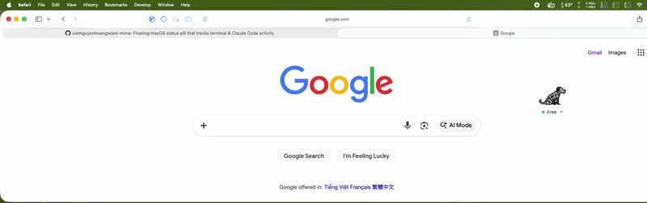
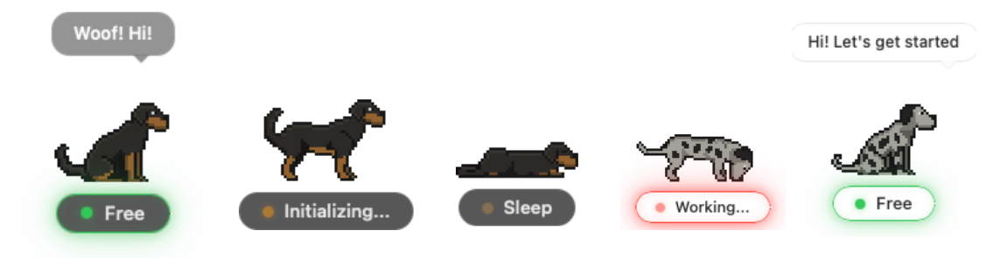
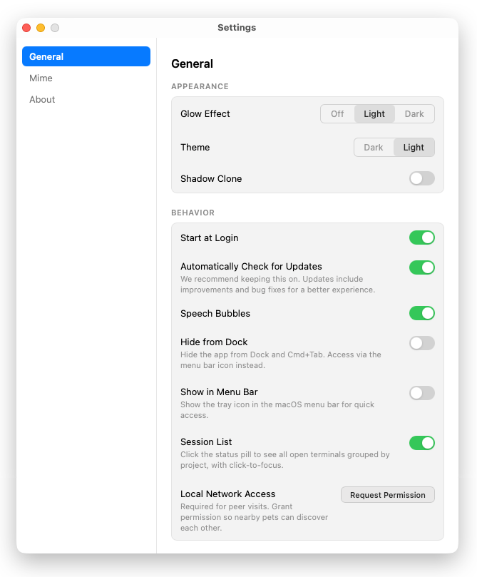
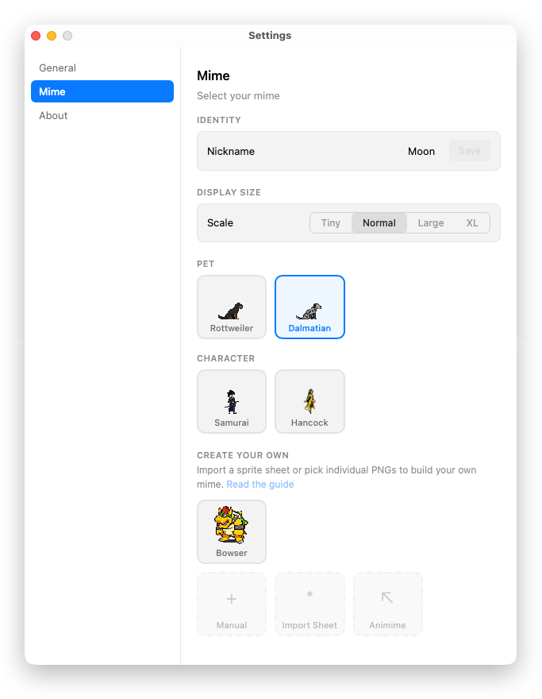
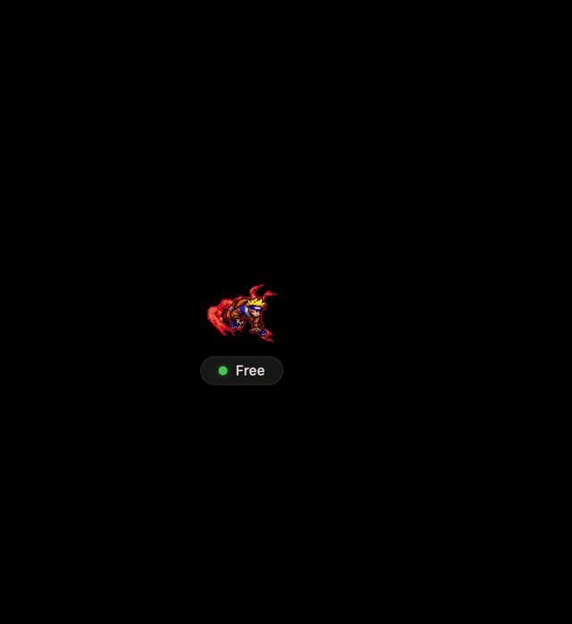
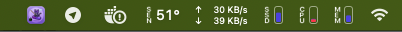
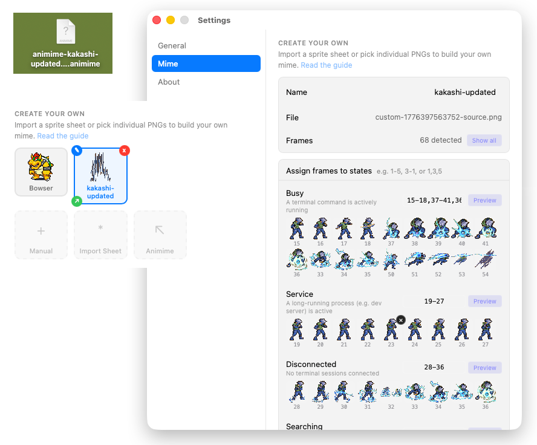
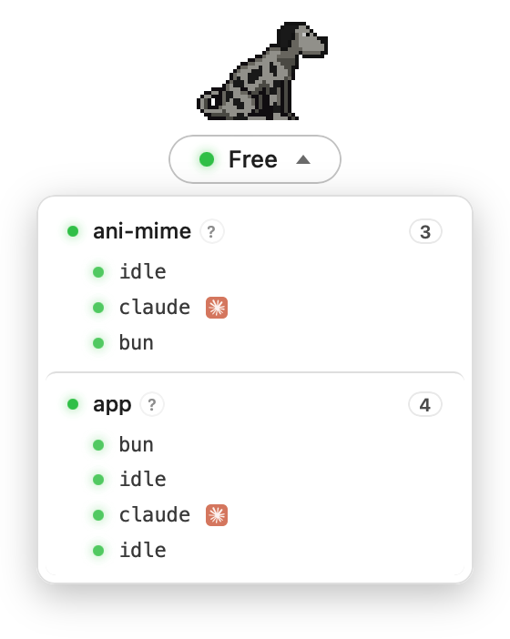

# Ani-Mime

<p align="center">
  
</p>

<p align="center">
  <strong>A floating pixel mascot that mirrors your terminal & Claude Code activity on macOS.</strong>
</p>

<p align="center">
  <a href="https://github.com/vietnguyenhoangw/ani-mime/releases"></a>
  <a href="https://github.com/vietnguyenhoangw/ani-mime/blob/main/LICENSE"></a>
  
</p>

<p align="center">
  
</p>

---

## What is Ani-Mime?

A tiny always-on-top pixel dog that reacts to what your terminal is doing. It sniffs when you're building, barks when a dev server is running, sits when you're free, and sleeps when nothing's happening.

It also integrates with **Claude Code** — the dog knows when Claude is thinking vs waiting for you.

<p align="center">
  
</p>

## Contributors

Ani-Mime wouldn't be the same without these wonderful people. Thank you for your time, ideas, and code — you made this project better.

<table>
  <tr>
    <td align="center">
      <a href="https://github.com/thnh-dng">
        
        <br />
        <sub><b>thnh-dng</b></sub>
      </a>
    </td>
    <td align="center">
      <a href="https://github.com/yanmad27">
        
        <br />
        <sub><b>yanmad27</b></sub>
      </a>
    </td>
    <td align="center">
      <a href="https://github.com/thanh-dong">
        
        <br />
        <sub><b>thanh-dong</b></sub>
      </a>
    </td>
    <td align="center">
      <a href="https://github.com/setnsail">
        
        <br />
        <sub><b>setnsail</b></sub>
      </a>
    </td>
    <td align="center">
      <a href="https://github.com/QuangHo0911">
        
        <br />
        <sub><b>QuangHo0911</b></sub>
      </a>
    </td>
    <td align="center">
      <a href="https://github.com/cuongtranba">
        
        <br />
        <sub><b>cuongtranba</b></sub>
      </a>
    </td>
  </tr>
</table>

## Mascot States

| Status | Dot | Mascot | Meaning |
| :--- | :--- | :--- | :--- |
| **Free** | Green | Sitting | Terminal idle, ready for commands |
| **Working** | Red (pulse) | Sniffing | Running a task (build, git push, etc.) |
| **Service** | Blue | Barking | Dev server launched (vite, metro, etc.) |
| **Searching** | Yellow (pulse) | Idle | Waiting for connection |
| **Sleep** | Gray | Sleeping | Terminal closed or 10s of inactivity |

## Features

- **Pixel Art Mascot** — animated sprite sheet dog above the status pill
- **Custom Sprites** — upload your own PNG sprite sheets via manual import or smart extraction with chroma-key background removal
- **Frame Range Expressions** — specify frames as ranges like `1-5` or `41-55,57,58` when importing custom sprites
- **Display Scale** — resize your mascot with Tiny / Normal / Large / XL presets
- **Peer Visits** — discover other Ani-Mime users on your local network via Bonjour/mDNS; right-click to send your pet to visit theirs
- **Manual Tagging** — zsh hooks classify commands as `task` or `service`
- **Heartbeat + OS Scan** — hooks drive state transitions; a 2s libproc scan auto-discovers every live shell and cleans up zombies
- **Session Dropdown** — click the status pill to see every open terminal grouped by project path, with the foreground command (`claude`, `bun`, etc.), and click any row to jump straight to that tab (see [Session List & Click-to-Focus](#session-list--click-to-focus))
- **Claude Code Hooks** — tracks when Claude is actively working vs waiting
- **MCP Server** — Claude Code can talk to your pet: trigger speech bubbles, play reaction animations, and check pet status via MCP tools
- **Multi-Session** — handles multiple terminals, priority: busy > service > idle
- **Auto-Setup** — first launch configures zsh hooks and Claude Code hooks via native macOS dialogs
- **All Workspaces** — visible on every macOS Space/desktop
- **Menu Bar Tray Icon** — always-visible tray icon with right-click menu; left-click toggles mascot visibility
- **Hide from Dock** — optional setting to remove the app from Dock and Cmd+Tab, running as a menu bar-only app
- **Low Footprint** — Rust + Tauri, minimal CPU and RAM

## Screenshots

<table>
  <tr>
    <td></td>
    <td></td>
    <td></td>
  </tr>
  <tr>
    <td align="center"><strong>General settings</strong></td>
    <td align="center"><strong>Customize your favorite Mime</strong></td>
    <td align="center"><strong>Shadow Clone feature</strong></td>
  </tr>
  <tr>
    <td></td>
    <td></td>
    <td></td>
  </tr>
  <tr>
    <td align="center"><strong>Show on menu bar</strong></td>
    <td align="center"><strong>One-click import &amp; export your Mime</strong></td>
    <td></td>
  </tr>
</table>

---

## Session List & Click-to-Focus

Click the status pill to open a dropdown listing every open terminal, grouped by working directory:

<p align="center">
  
</p>

**Click any row** and Ani-Mime brings that terminal to the front. For apps with scripting support it jumps to the specific tab; for the rest it just activates the app. The walk up the process tree uses `pidpath` + a `ps`-based ppid map, so it works even across root-owned ancestors like `/usr/bin/login`.

### Terminal app support matrix

| App                        | Activate | Tab-precise focus | How                                                                                               |
| -------------------------- | :------: | :---------------: | ------------------------------------------------------------------------------------------------- |
| **iTerm2**                 |    ✅    |         ✅        | AppleScript: matches the `tty` property on every session                                          |
| **Terminal.app**           |    ✅    |         ✅        | AppleScript: matches the `tty` property on every tab                                              |
| **VS Code**                |    ✅    |      ⚠️ Window    | System Events + window title contains the workspace folder name (can't target individual panes — Electron) |
| **Cursor**                 |    ✅    |      ⚠️ Window    | Same approach as VS Code                                                                          |
| **tmux** (inside any host) |    ✅    |         ✅        | `tmux select-pane -t` + `select-window` + `switch-client` matched by `pane_tty`; host app also activated |
| **Warp**                   |    ✅    |         ❌        | No public scripting API for tabs — activation only                                                |
| **WezTerm**                |    ✅    |         ❌        | Has a `wezterm cli` pane API but no pid→pane mapping from outside                                 |
| **Alacritty / kitty / Hyper / Ghostty** | ✅ | ❌         | No inter-app scripting exposed — activation only                                                  |
| **ssh session**            |    ✅    |         ❌        | Remote shells resolve to the local ssh ancestor — activate the local terminal                    |

### Permissions

The first time Ani-Mime tries to script another app, macOS will prompt:

- **iTerm / Terminal** — Automation permission. Grant once; subsequent clicks target the exact tab.
- **VS Code / Cursor** — Accessibility permission (required by System Events to raise windows). Find Ani-Mime under **System Settings → Privacy & Security → Accessibility** and enable it.

Without these permissions, the click still brings the app to the front via `open -a` (Launch Services, no permission needed) — you just lose the precise tab / window targeting.

---

## Install

### Homebrew (recommended)

```bash
brew tap vietnguyenhoangw/ani-mime
brew install --cask ani-mime
```

Open the app. On first launch, Ani-Mime will:
1. Ask to add a hook to your `~/.zshrc` (required for terminal tracking)
2. Ask to configure Claude Code hooks (optional)

Open a new terminal tab and the mascot starts reacting.

The MCP server is also auto-configured so Claude Code can interact with your pet directly (see [MCP Server](#mcp-server) below).

### Manual (from source)

```bash
git clone https://github.com/vietnguyenhoangw/ani-mime.git
cd ani-mime
bun install
bun tauri dev
```

Then source the zsh script:

```bash
echo 'source "/path/to/ani-mime/src-tauri/script/terminal-mirror.zsh"' >> ~/.zshrc
source ~/.zshrc
```

---

## Requirements

- **macOS** (Intel or Apple Silicon)
- **zsh** (default shell on macOS)
- **Claude Code** (optional) — for Claude activity tracking

## Tech Stack

- **Frontend:** React 19, TypeScript, Vite
- **Backend:** Rust, Tauri v2, tiny_http
- **Shell:** zsh hooks (preexec / precmd)
- **Sprites:** CSS sprite sheet animation (128×128 pixel art, scalable)
- **Testing:** Vitest (unit), Playwright (e2e)

---

## Testing

```bash
# Unit tests
bun run test

# E2E tests (requires dev server on :1420)
npx playwright test --config=e2e/playwright.config.ts
```

The e2e suite covers app startup, status transitions, speech bubbles, scenario mode, settings, custom sprite upload (including frame range expressions), sprite display sizing, and custom sprite editing.

---

## Peer Visits

Ani-Mime instances on the same local network automatically discover each other via mDNS (Bonjour). Right-click your mascot to see nearby peers and send your pet to visit them.

### Requirements

- Both machines on the **same WiFi / LAN subnet**
- **macOS Local Network permission** — allow when prompted on first launch (or enable in System Settings > Privacy & Security > Local Network)

### Troubleshooting

If peers can't find each other:

1. Check that both machines are on the same network (`192.168.x.x` subnet)
2. Verify Local Network permission is enabled for ani-mime on both machines
3. Run `dns-sd -B _ani-mime._tcp local.` in Terminal — you should see both instances
4. Run `curl http://127.0.0.1:1234/debug` to check the registered IP and peer list
5. If sharing the app via DMG without a Developer ID, the recipient must run:
   ```bash
   xattr -cr /Applications/ani-mime.app
   ```

See [docs/peer-discovery.md](docs/peer-discovery.md) for the full protocol reference.

---

## MCP Server

Ani-Mime includes an MCP (Model Context Protocol) server that lets Claude Code interact with your pet during conversations.

### What It Does

| Tool | Description |
|------|-------------|
| `pet_say` | Make your pet say something via a speech bubble |
| `pet_react` | Trigger a reaction animation (celebrate, nervous, confused, excited, sleep) |
| `pet_status` | Check what your pet is doing, who's visiting, nearby peers, and uptime |

### Setup

The MCP server is automatically configured during first-launch setup (when you accept Claude Code hooks). If you need to set it up manually:

```bash
claude mcp add ani-mime -- node ~/.ani-mime/mcp/server.mjs
```

The server script is updated automatically on every app launch.

### How It Works

```
Claude Code <--stdio--> MCP Server (Node.js) <--HTTP--> Ani-Mime :1234 --> Pet UI
```

Claude Code calls MCP tools during conversations. The MCP server translates them to HTTP requests to the local Ani-Mime server, which emits Tauri events to the frontend. The pet reacts with speech bubbles or animation changes.

---

## Building for Release

```bash
# Build the Tauri app
bun run tauri build

# Re-sign with entitlements and re-create the DMG
# (required because Tauri doesn't embed entitlements for ad-hoc signing)
bash src-tauri/script/post-build-sign.sh
```

The signed DMG is output to `src-tauri/target/release/bundle/dmg/`.

**Without the post-build sign step**, the app will run on the build machine but peer discovery (mDNS) and the HTTP server will silently fail on other machines due to missing network entitlements.

If the recipient sees "app is damaged", they need to remove the quarantine attribute:

```bash
xattr -cr /Applications/ani-mime.app
```

---

## Contributing

1. Fork the repo
2. Create a feature branch (`git checkout -b feature/amazing`)
3. Commit your changes (`git commit -m 'Add amazing feature'`)
4. Push (`git push origin feature/amazing`)
5. Open a Pull Request

Contributions for new pixel art sprites, Rust logic improvements, or UI enhancements are welcome.

## License

MIT. See [LICENSE](LICENSE) for details.
